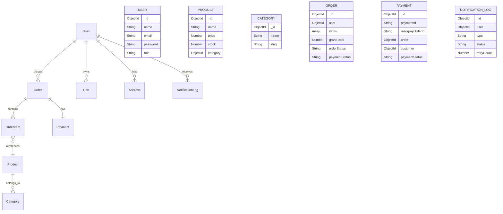

# Database Entity-Relationship Diagram

```mermaid
erDiagram
    User ||--o{ Order : places
    User ||--o{ Cart : owns
    User ||--o{ Address : has
    User ||--o{ NotificationLog : receives

    Product ||--o{ Category : belongs_to
    
    Order ||--|{ OrderItem : contains
    OrderItem }o--|| Product : references
    
    Order ||--|| Payment : has

    USER {
        ObjectId _id
        String name
        String email
        String password
        String role
    }

    PRODUCT {
        ObjectId _id
        String name
        Number price
        Number stock
        ObjectId category
    }

    CATEGORY {
        ObjectId _id
        String name
        String slug
    }

    ORDER {
        ObjectId _id
        ObjectId user
        Array items
        Number grandTotal
        String orderStatus
        String paymentStatus
    }

    PAYMENT {
        ObjectId _id
        String paymentId
        String razorpayOrderId
        ObjectId order
        ObjectId customer
        String paymentStatus
    }

    NOTIFICATION_LOG {
        ObjectId _id
        ObjectId user
        String type
        String status
        Number retryCount
    }
```
